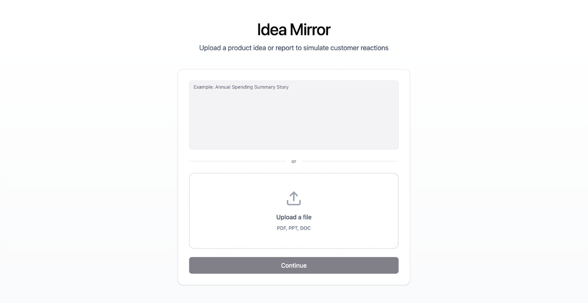
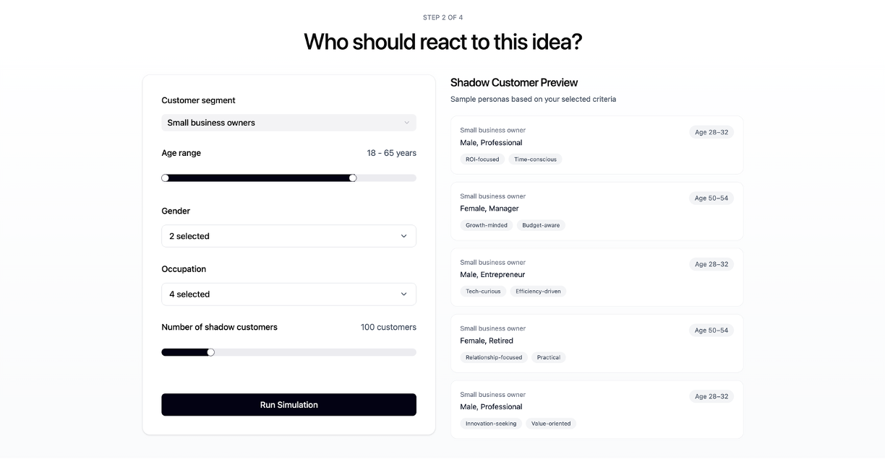
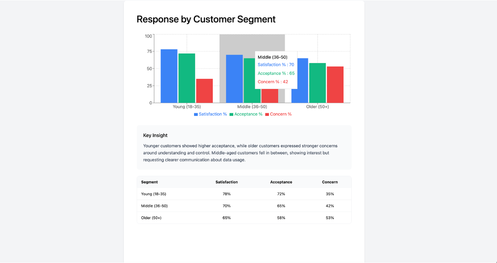

### Idea Mirror
AI-powered customer simulation for early product validation

#### Background

Idea Mirror was created during the She Innovates 2026 Hackathon as a prototype to help Product Managers validate ideas faster before committing resources.

#### Problem

Product Managers often struggle to answer early-stage questions such as:

- Is this idea worth building?

- How would different customer segments react?

- Can we get directional feedback without running a full research study?

- Traditional user research is time-consuming and expensive, especially at the ideation stage.

#### Solution

Idea Mirror introduces AI-generated “shadow customers” that simulate realistic customer reactions based on selected demographics and behavioral traits.

PMs can:

- Upload an idea or document

- Define target customer segments

- Run simulations with hundreds of AI customers

- Receive a synthesized report for decision-making

#### Key Features

AI customer persona simulation

Configurable demographics and behaviors

Fast, low-cost idea validation

PM-ready insight reports

#### Prototype

Figma Prototype (Interactive Demo)
Link below:
https://quest-mask-76730639.figma.site/

#### Screens

#### Team & Role

Hackathon team project

My role: Product ideation, UX design, and AI concept design
